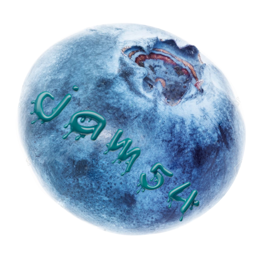

# Jam54_Launcher
The Jam54 Launcher is used to install and update all the software developed by jam54. The launcher itself is written in C# and developed with Unity.
> Unity was chosen over a traditional developing environment like WinForms or WPF, since it offered better/more features that are used within the launcher.

---

## Functionality
The launcher itself updates automatically to the latest version available. For this purpose the [Squirrel Updater](https://github.com/Squirrel/Squirrel.Windows) has been used.

The programs/games available within the launcher can either be updated manually or automatically. For this a custom build solution has been developed that makes use of delta updates. This only requires the user to download new files or the files that have been changed, not the whole application. This significantly saves time and bandwidth.

Furthermore, the launcher can be used in a variety of languages and the user can choose a specific install location.

## Downloading the launcher
You can download the launcher from [here](https://jam-54.wixsite.com/jam54/download).

---

# Getting the project

### How do I clone the Jam54 Launcher
Open [GitHub Desktop](https://desktop.github.com/) *> file > Clone repository > URL* > enter the following url: https://github.com/jam53/Jam54_Launcher.git and press Clone

### Getting the right version of Unity
Once you cloned the repository, you should install the most recent, stable version of Unity. Make sure you also include *Windows Build Support (IL2CPP)* during the installation.

### Main scene
The **main scene** for this project can be found under:

*Assets > Jam54Launcher > Scenes > MainMenu*

Open the **MainMenu scene**, and hit **play.**

> **Important Note**

Inside the Unity project's rootfolder, there is a Visual Studio C# WPF project located under the folder Jam54LauncherStarter. This instanciates Squirrel and therefore updates the Jam54Launcher. Once the Jam54Launcher has succesfully been updated, the Jam54LauncherStarter will launch the Jam54Launcher.

Besides the Jam54LauncherStarter, there is another Visual Studio project called HashesCreator. This is a console application made using .NET core. It's purpose is to create a textfile that contains the name + the hash of all the files in folder selected by the developer. Using this textfile we can easily figure out what part of a certian program/game has been changed. And therefore only update those specific files when there is an update. Instead of having to download the whole application. 
> *Make sure to 'Publish' this application in Visual Studio when you want to create the final executable. This can be achieved by right-clicking the project > properties > Publish > Publish. This will create a single exe that contains all the necessary files.*

Furthermore, there is a Visual Studio, C# console .NET core project called MakePNGGrayScale. This takes the .png files in the current directory + all subdirectories, and creates a grayscale variant. This grayscale image is placed in the folder where the MakePNGGrayScale executable is running from.
> *Make sure to 'Publish' this application in Visual Studio when you want to create the final executable. This can be achieved by right-clicking the project > properties > Publish > Publish. This will create a single exe that contains all the necessary files.*

## Development of the Jam54 Launcher

The main reason behind the development of the launcher, was to create one unified place for people to download all the games/programs that have been developed by jam54. Instead of having to search for download links that are scattered all over the [official website.](https://jam-54.wixsite.com/jam54)
